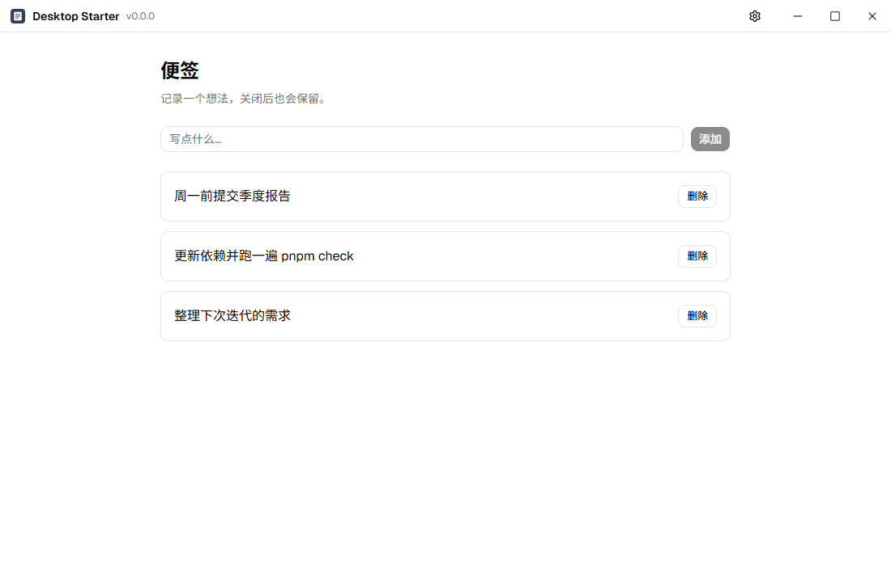
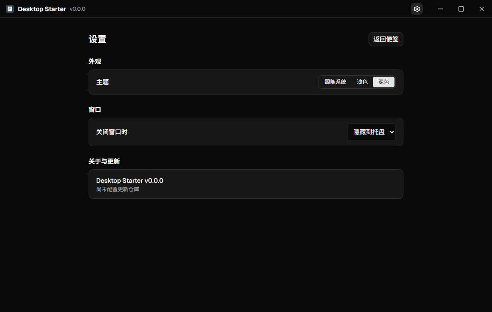

<div align="center">


# Desktop Starter

从 [DevHub](https://github.com/Delta1035/devhub) 提取的独立 Electron + React + TypeScript 桌面应用模板：一条命令换上自己的产品标识，就能打包、发布并自动更新。

[English](README.md) · **简体中文**

[](https://github.com/Delta1035/electron-desktop-template/actions/workflows/ci.yml)

[](LICENSE)
[](CONTRIBUTING.md)


[创建新应用](#创建新应用) · [打包与发布](#打包与发布) · [内容](#内容) · [参与贡献](CONTRIBUTING.md)

</div>

目标平台 Windows 与 Ubuntu；macOS 仅保留兼容结构，未验证。

<table>
  <tr>
    <td></td>
    <td></td>
  </tr>
</table>

## 创建新应用

Node >=22，pnpm 11.9.0。

```powershell
pnpm install --frozen-lockfile
# 预览变更（不写入任何文件）
pnpm initialize --project-name my-tool --product-name "我的工具" --app-id com.example.mytool `
  --author "Example" --homepage https://example.com/my-tool --repository owner/my-tool
# 确认无误后，用相同参数并追加 --yes 再执行一次，写入文件
pnpm check
pnpm e2e
pnpm dev
```

| 参数             | 用途                                                                       |
| ---------------- | -------------------------------------------------------------------------- |
| `--project-name` | 小写字母、数字、中划线；根包名、可执行文件、安装子目录、安装包与更新缓存名 |
| `--product-name` | 标题栏、窗口标题、托盘、安装器与快捷方式                                   |
| `--app-id`       | 反向域名；数据目录、主题存储键、Windows 应用身份。不能使用模板默认值       |
| `--author`       | 包元数据与 Linux 安装包维护者                                              |
| `--homepage`     | 产品主页，http/https                                                       |
| `--repository`   | 可选，GitHub `owner/repo`，作为自动更新源；省略时更新与发布源完全关闭      |

初始化只结构化地改写 `app.config.json`、`package.json`、`apps/desktop/package.json` 三个文件，其余代码与打包配置都在构建时读取 `app.config.json`。行为：

- 参数缺失或无效、目录不是本模板、标识文件被手动改得不一致时，列出全部问题并以退出码 2 结束，不写入任何文件。
- 先写临时文件再逐个替换；写入失败时恢复已替换的文件并以退出码 1 结束，提示恢复办法。
- 用相同参数重复执行不会产生任何改动。修改已初始化项目的 appId 需追加 `--allow-app-id-change`：新 appId 意味着新的数据目录与安装身份，旧安装不会被升级覆盖。

初始化后，请按自己的产品改写 README、`LICENSE` 的版权人以及 `docs/assets/` 中的截图。

图标：替换 `apps/desktop/build/*.svg` 后运行 `pnpm --filter @desktop/desktop icons`。

Linux CI 使用 `xvfb-run -a pnpm e2e`；VS Code 终端若设置了 ELECTRON_RUN_AS_NODE，启动前需清除。E2E 会自动清除该变量，并使用临时数据目录。

## 打包与发布

```powershell
pnpm --filter @desktop/desktop build:win     # NSIS 安装包，可选择目录并自动创建 <projectName> 子目录
pnpm --filter @desktop/desktop build:linux   # AppImage + deb
node scripts/verify-package.mjs              # 校验产物名称与更新源
```

- `pnpm identity`（已包含在 `pnpm check` 中）检查各文件与 `app.config.json` 一致，并扫描来源应用残留的标识。
- `pnpm release patch|minor|major` 会先执行发布模式检查（不允许模板默认值，必须配置 repository），再修改版本、提交并打 tag；执行 `git push --follow-tags` 后，`release.yml` 会核对 tag、标识和当前仓库，在两个平台检查、打包后创建草稿 Release。
- 未配置 repository 时显式关闭发布，不会从 git remote 推断更新源。安装包不签名。

## 内容

保留单实例、托盘、自定义标题栏、自动 IPC、错误通道、事件、JSON 存储、设置、主题、原生文件选择、安全外链、通用 UI、更新与 E2E 诊断。便签是独立示例，展示 UI → AppApi → IPC → core → JSON 存储的完整链路。参见 [架构](docs/ARCHITECTURE.md) 和 [删除示例](docs/REMOVE-EXAMPLE.md)。

模板副本不会自动获取上游修复。内部包名固定为 `@desktop/*`，无需替换。

## Star History

[](https://star-history.com/#Delta1035/electron-desktop-template&Date)

## 许可证

[MIT](LICENSE)
